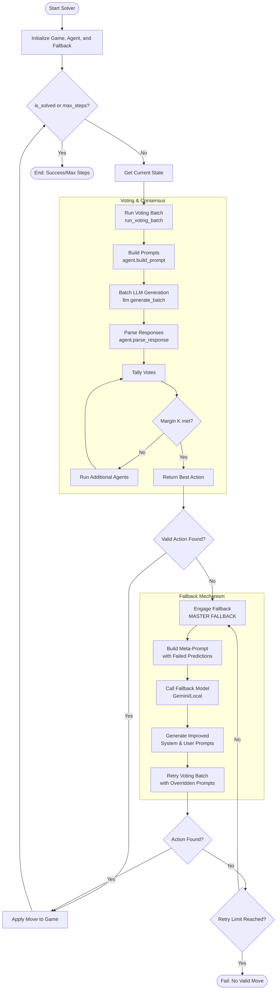

# Sliding Puzzle Solver Flow

This diagram illustrates the execution flow of the MAKER framework for the Sliding Puzzle, highlighting the voting process and the fallback mechanism.

## Flow Description

### 1. Voting & Consensus
- **Batch Generation**: The `run_voting_batch` function triggers multiple agent instances in parallel.
- **Parsing**: `agent.parse_response` extracts the predicted move and the expected resulting state. If parsing fails (regex mismatch or invalid move), it records a `FailedPrediction`.
- **Margin K**: The system ensures the winning move has at least `k` more votes than the runner-up to ensure high-confidence steps.

### 2. Fallback Mechanism
- **Trigger**: Activated only when the voting batch returns no valid `best_action` (typically because all agents failed to provide a valid parse).
- **Meta-Reasoning**: The `FallbackModel` takes the original prompts and the specific failure reasons (e.g., "Invalid move [2, 0] for current state") and asks a stronger model to rewrite the instructions.
- **Prompt Overrides**: The `run_voting_batch` function is called again, but this time using `system_prompt_override` and `user_prompt_override` provided by the fallback model.
